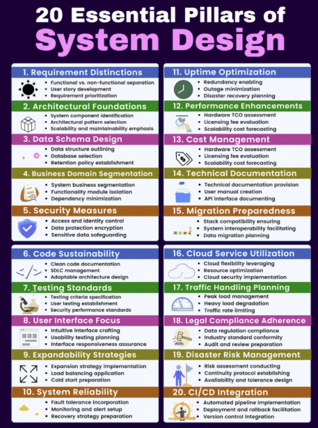

  

[-000000?style=for-the-badge&logo=github&logoColor=white)](https://github.com/Ratnesh-181998/Modern-Full-Stack-Development-Roadmap-AI-Era)

[-0f766e?style=for-the-badge)](https://github.com/Ratnesh-181998/Agentic-AI-and-GeN-AI-Cloud-Stack-AWS-GCP-Azure)

# 🚀 Modern Full-Stack Development Roadmap (AI Era)

Welcome to the **Ultimate Roadmap for Modern Full-Stack Development** specifically designed for the **AI Era**. This comprehensive guide covers everything from foundational programming to advanced AI architectures, ensuring you stay ahead in the rapidly evolving tech landscape.

---

## 🗺️ Roadmap Overview

### 🏁 Phase 1: Foundational Programming & AI Literacy
The bedrock of your journey. Mastering the core languages and understanding the "why" behind AI.
- **Core Programming:** Python (AI/ML King), JavaScript/TypeScript, DS & Algorithms.
- **AI Literacy:** ML Basics, LLM Overviews, Prompt Engineering, Ethics.
- **Environment:** VS Code (AI-enabled), Jupyter, Package Management (`pip`, `npm`).

---

## 🖼️ Visual Roadmaps & References

### 1. 🏗️ 20 Essential Pillars of System Design

### 2. 🗺️ Modern Full-Stack Development Roadmap
.jpeg)

> [📄 View Original Roadmap Source Text](./Modern%20Full-Stack%20Development%20Roadmap%20(AI%20Era).txt)

---

### 🎨 Phase 2: Modern Frontend (AI-Enabled)
Building interfaces that breathe with AI.
- **Stack:** React 18+ / Next.js 14+, Tailwind CSS, shadcn/ui.
- **AI UI/UX:** AI-enhanced components, real-time feedback, intelligent forms.
- **Optimization:** Edge computing (Vercel), Predictive prefetching, WebGPU.

### ⚙️ Phase 3: Intelligent Backend
Creating robust APIs that bridge the gap between users and models.
- **Frameworks:** Node.js/Express, Python FastAPI (High performance).
- **AI Layer:** OpenAI/Anthropic/Gemini APIs, Vector DBs (Pinecone, Weaviate).
- **Streaming:** WebSockets & Server-Sent Events (SSE) for real-time LLM responses.

### 🧠 Phase 4: AI/ML Integration
Diving deep into application patterns.
- **Patterns:** RAG (Retrieval-Augmented Generation), AI Agents, Function Calling.
- **Tooling:** LangChain, LangGraph, LlamaIndex.
- **Management:** Local models (Ollama), Fine-tuning, Cost optimization.

### 📊 Phase 5: Data Engineering for AI
Fueling your models with high-quality data.
- **Modern Stack:** PostgreSQL (pgvector), Airflow, Snowflake, Kafka.
- **Search:** Embeddings, Similarity search, Hybrid search strategies.
- **Processing:** ETL/ELT pipelines, Synthetic data generation.

### ☁️ Phase 6: Cloud & AI Infrastructure
Scaling your intelligence to the world.
- **Platforms:** Vercel AI SDK, AWS Bedrock, Google Vertex AI.
- **Serverless:** AWS Lambda, Edge functions, Cold start optimization.
- **MLOps:** Experiment tracking (MLflow), Monitoring, CI/CD for AI.

### 🤖 Phase 7: Advanced AI Architectures
The bleeding edge of automation.
- **Agent Systems:** Multi-agent orchestration, Human-in-the-loop.
- **Applications:** AI search, Recommendation engines, Anomaly detection.
- **Personalization:** Behavioral modeling, Dynamic content, Privacy-first AI.

### 🛡️ Phase 8: DevOps & Security
Keeping your AI production-ready and safe.
- **Containers:** Docker (GPU support), Kubernetes integration.
- **Observability:** Latency/Token tracking, Drift detection, Cost monitoring.
- **Security:** GDPR/CCPA compliance, Secure API management, Ethical AI.

### 🌟 Phase 9: Emerging Technologies
What’s next?
- **Frameworks:** React Server Components (RSC) with AI integration.
- **Capabilities:** Multimodal AI (Image/Audio/Text), AI code assistance.
- **Trends:** Small Language Models (SLMs), On-device inference, Quantum AI.

---

## 🛠️ Essential Tech Stack

| Category | Recommended Tools |
| :--- | :--- |
| **Languages** | Python, TypeScript |
| **Frontend** | Next.js, Tailwind, shadcn/ui |
| **Backend** | FastAPI,Python,AI/ML, Node.js |
| **AI Frameworks** | LangChain, LlamaIndex, Vercel AI SDK |
| **Databases** | Pinecone, PostgreSQL (pgvector), Weaviate |
| **Cloud** | Vercel, AWS, Google Cloud Vertex |

---

## 🏗️ Projects to Build
1.  **AI Chatbot with RAG:** Build a system that answers questions based on your own docs.
2.  **Multi-modal Search Engine:** Search through images and text simultaneously.
3.  **AI Agent for Task Automation:** Create an agent that can browse the web and perform tasks.
4.  **Personalized AI Tutor:** A learning platform that adapts to your pace.
5.  **Analytics Dashboard:** Real-time insights powered by AI suggestions.

---

## 📈 Progression Strategy
*   **Months 1-3:** AI Literacy + Basic Integration
*   **Months 4-6:** RAG Systems + Vector Databases
*   **Months 7-9:** AI Agents + Advanced Patterns
*   **Months 10-12:** Production AI Systems + Optimization
*   **Year 2+:** Specialization & Cutting-edge Research

---

## 💡 Mindset for the AI Era
> "The AI field moves fast. Focus on transferable principles (RAG, embeddings, agents) rather than specific tools that may become obsolete."

- **Learn by Building:** Every project should incorporate AI meaningfully.
- **Probabilistic Thinking:** Handle AI uncertainty gracefully in your UI/UX.
- **Cost/Performance:** Always weigh the cost of API calls vs. user value.

---

## 📬 Resources
- **Learning:** OpenAI Cookbook, Discovery with LangChain, Vercel AI Examples.
- **Practice:** Buildspace, AI Hackathons, Kaggle.
- **Community:** LocalLLaMA (Reddit), AlphaSignal Newsletter, AI Engineering Discord.

---

## 📜 **License**

**Licensed under the MIT License** - Feel free to fork and build upon this innovation! 🚀

---

# 📞 **CONTACT & NETWORKING** 📞

### 💼 Professional Networks

### 🚀 AI/ML & Data Science

### 💻 Competitive Programming (Including all coding plateform's 5000+ Problems/Questions solved )

---

## 📊 **GitHub Stats & Metrics** 📊

---

